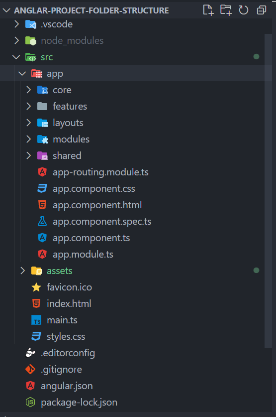
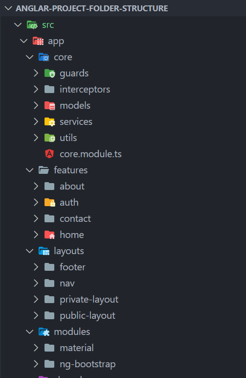
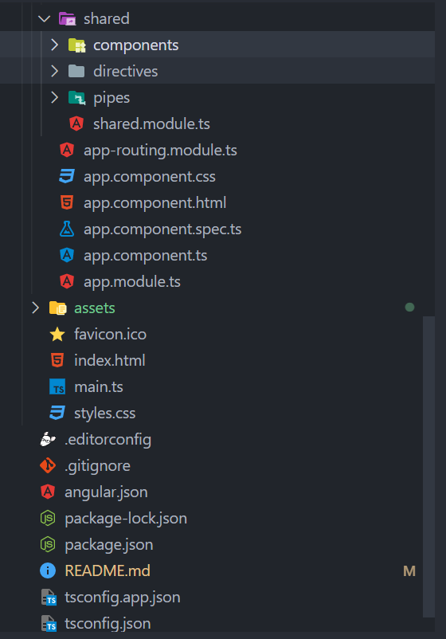
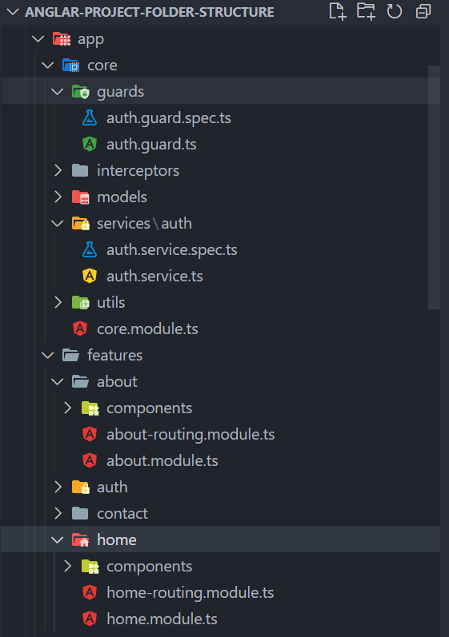
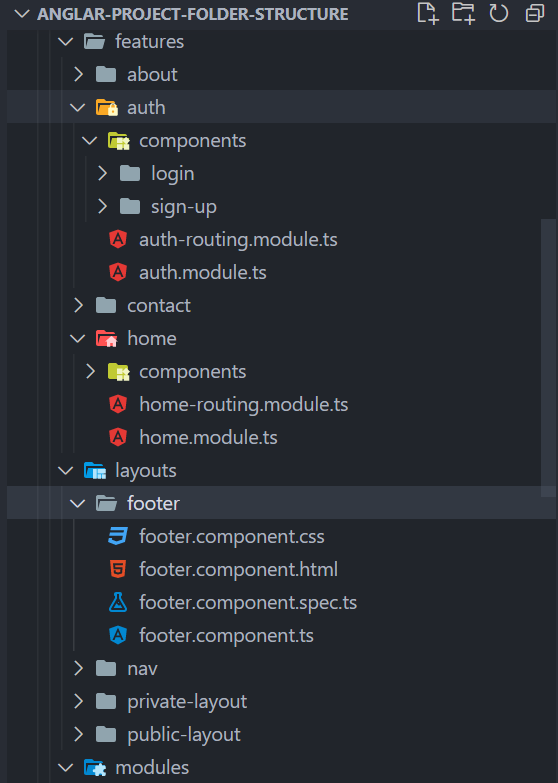

# Let's go through each folder in more detail:
## app/core
--> This directory contains core functionality such as guards, interceptors, models, services, and utility functions used across the application.

## app/features
--> This directory contains feature modules, each representing a specific functionality or module in your application. Each feature module can have its own components, services, and other related files.

## app/shared
--> This directory contains shared components, directives, and pipes that can be used across multiple feature modules.

## app/layout
--> This directory contains layout-related components such as header, sidebar, and footer.

## app/app.component.ts
--> The root component of your application.

## app/app.module.ts
--> The root module of your application.

## app/app-routing.module.ts
--> The routing module that defines the application's routes and their corresponding components.

## assets
--> This directory contains static assets such as images, stylesheets, and other resources.

## environments
--> This directory contains environment-specific configuration files.

## index.html
--> The main HTML file of your application.

## main.ts
--> The entry point file that bootstraps your Angular application.

## styles.css
--> The main styles file where global styles and imports are defined.

# AngularProjectFolderStructure

This project was generated with [Angular CLI](https://github.com/angular/angular-cli) version 15.2.8.

## Development server

Run `ng serve` for a dev server. Navigate to `http://localhost:4200/`. The application will automatically reload if you change any of the source files.

## Code scaffolding

Run `ng generate component component-name` to generate a new component. You can also use `ng generate directive|pipe|service|class|guard|interface|enum|module`.

## Build

Run `ng build` to build the project. The build artifacts will be stored in the `dist/` directory.

## Running unit tests

Run `ng test` to execute the unit tests via [Karma](https://karma-runner.github.io).

## Running end-to-end tests

Run `ng e2e` to execute the end-to-end tests via a platform of your choice. To use this command, you need to first add a package that implements end-to-end testing capabilities.

## Further help

To get more help on the Angular CLI use `ng help` or go check out the [Angular CLI Overview and Command Reference](https://angular.io/cli) page.
